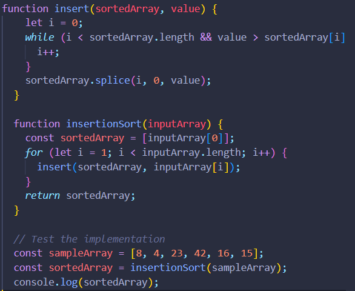
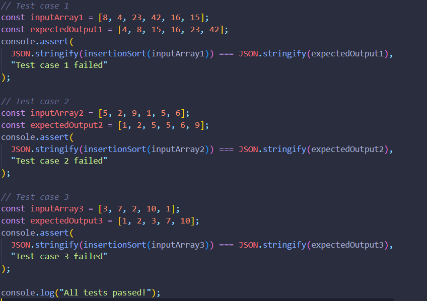

# Blog Notes: Insertion Sort

# Understanding the Pseudocode

## Insert Function

### The Insert function takes a sorted array (sorted) and a value to be inserted (value). It finds the correct position for the value within the sorted array while maintaining its sorted order. Here's how it works:

1-Initialize i to 0.

2-While value is greater than sorted[i], increment i to find the correct insertion point.

3-Once the correct insertion point is found, shift elements to the right to make space for the value.

4-Append the value to the sorted array.

---

# InsertionSort Function

### The InsertionSort function takes an input array (input) and sorts it using the Insert function. It maintains a separate sorted array and iterates through the input array, inserting each element into the sorted array while maintaining its sorted order.

Tracing the Algorithm with the Sample Array
Let's trace the algorithm with the sample array [8, 4, 23, 42, 16, 15]:

Initial state: sorted = [], input = [8, 4, 23, 42, 16, 15]

- i = 0: sorted = [8], input = [4, 23, 42, 16, 15]
- i = 0: sorted = [4, 8], input = [23, 42, 16, 15]
- i = 2: sorted = [4, 8, 23], input = [42, 16, 15]
- i = 1: sorted = [4, 8, 23, 42], input = [16, 15]
- i = 3: sorted = [4, 8, 16, 23, 42], input = [15]
- i = 2: sorted = [4, 8, 15, 16, 23, 42], input = []
  The sorted array is now [4, 8, 15, 16, 23, 42].
  ***

## Working code

## Testing

