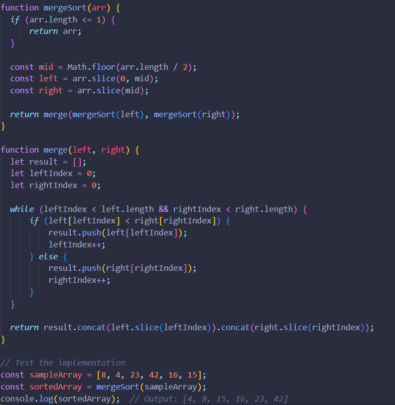

## Step 1: Initial Array

Our initial array is [8, 4, 23, 42, 16, 15]. Let's visualize this array:
[8, 4, 23, 42, 16, 15]

## Step 2: Splitting

We begin by splitting the array into smaller halves until each subarray contains only one element. This process creates a binary tree structure. Visual representation of divisions:
[8, 4, 23, 42, 16, 15]
/ \
[8, 4, 23] [42, 16, 15]
/ \ / \
[8, 4] [23] [42] [16, 15]
/ \ / / \
[8] [4] [42] [16] [15]

## Step 3: Merging

Merge: [8] and [4]
Result: [4, 8]

Merge: [23] and [4, 8]
Result: [4, 8, 23]

Merge: [42] and [16]
Result: [16, 42]

Merge: [15] and [16, 42]
Result: [15, 16, 42]

Merge: [4, 8, 23] and [15, 16, 42]
Result: [4, 8, 15, 16, 23, 42]

## Step 4: Final Sorted Array

[4, 8, 15, 16, 23, 42]
We've successfully sorted the array using the Merge Sort algorithm.

# Implementation

# Testing

